# T1A3 Terminal App

### URL:
- [Trello Board](https://trello.com/b/tWJwndoi/theresa-t1a3terminalapp)  
- [GitHub Repository](https://github.com/theresanx/Theresa-T1A3_TerminalApp)

## App Features
### Main Menu
- Displays all options the user can choose from
- If the user input is not a listed option, it prompts for a retry and error message appears

  
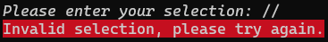

- ```while``` loop, nested with an ```if elif else``` statement prompts the ```create_menu``` function until the user selects option 5 to exit

<details>
<summary>Click to expand code</summary>

```
def create_menu():
    print(f"{colored.Fore.deep_sky_blue_4c}Enter 1 to add an expense to the list.")
    print("Enter 2 to remove an expense on the list.")
    print("Enter 3 to view all expenses on the list.")
    print("Enter 4 to search from a $ range on the list.")
    print(f"Enter 5 to exit.{colored.Style.reset}")

    user_choice = input(
        colored.stylize("Please enter your selection: ", styling.input)
    )
    return user_choice

choice = ""

while choice != "5":
    choice = create_menu()

    if choice == "1":
        functions.add_line_break()
        functions.add_expense(file_name)
    elif choice == "2":
        functions.add_line_break()
        functions.remove_expense(file_name)
    elif choice == "3":
        functions.add_line_break()
        functions.view_expense(file_name)
    elif choice == "4":
        functions.add_line_break()
        functions.search_expense(file_name)
    elif choice == "5":
        print(colored.stylize(
            "Thank you for using our Expense Tracker application.", styling.greeting
        ))
        functions.add_line_break()
    else:
        print(colored.stylize(
            "Invalid selection, please try again.", styling.error
        ))
        functions.add_line_break()
```
</details>

### Feature 1: Add Expense
- User inputs date, description and amount of a new expense
- If user input is valid, it displays a message to confirm expense has been added. Data is valid when date follows DD/MM/YYYY format and the amount is a positive float
- If user input is invalid, it prompts for a retry and error message appears
- Prompts if user would like to add another expense
- If user input is invalid for add another expense, it returns to the main menu

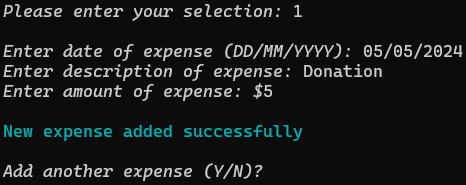  
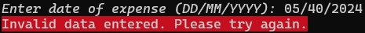 
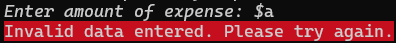  
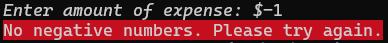  
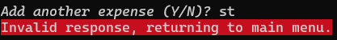

- ```add_expense``` and ```add_another_expense``` are separate functions to keep the them small (following Google Python style guide)
- CSV file is opened in ```append``` mode to add the new expense into an existing file
- Exception is raised to catch negative numbers and display the relevant error message

<details>
<summary>Click to expand code</summary>

```
def add_expense(file_name):
    try:
        date_input = input(
            colored.stylize("Enter date of expense (DD/MM/YYYY): ", styling.input)
        )
        date_expense = datetime.datetime.strptime(date_input,"%d/%m/%Y").strftime("%d-%m-%Y")
        description_input = input(
            colored.stylize("Enter description of expense: ", styling.input)
        )
        amount_input = format(float(input(
                colored.stylize(f"Enter amount of expense: $", styling.input)
        )),".2f")

        if float(amount_input) < 0:
            raise NegativeError

        with open(file_name, "a") as f:
            writer = csv.writer(f)
            writer.writerow([date_expense,description_input,amount_input])

        add_line_break()

        print(colored.stylized(
            "New expense added successfully", styling.output
        ))

        add_line_break()

        add_another_expense(file_name)

    except ValueError:
        print(colored.stylize(
            "Invalid data entered. Please try again.", styling.error
        ))
        add_expense(file_name)
    except NegativeError:
        print(colored.stylize(
            "No negative numbers. Please try again.", styling.error
        ))
        add_expense(file_name)

def add_another_expense(file_name):
    add_another_input = input(
        colored.stylize("Add another expense (Y/N)? ", styling.input)
    )
    if add_another_input.lower() == "y":
        add_line_break()
        add_expense(file_name)
    elif add_another_input.lower() == "n":
        add_line_break()
    else:
        print(colored.stylize(
            "Invalid response, returning to main menu.", styling.error
        ))
        add_line_break()
```
</details>

### Feature 2: Remove Expense
- Displays all expenses in list before user inputs line number of an existing expense to be removed
- If user input is valid, it displays a message. Data is valid when the line number is an integer
- If user input is invalid, it prompts for a retry and error message appears
- Prompts if user would like to remove another expense
- If user input is invalid for remove another expense, it returns to the main menu

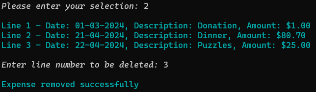  
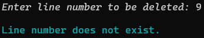  
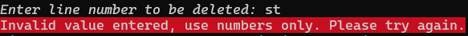  
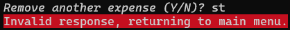

- ```remove_expense``` and ```remove_another_expense``` are separate functions to keep the them small (following Google Python style guide)
- CSV file is opened in ```reader``` mode locate expense line to be removed and then in ```writer``` mode to overwrite existing file

### Feature 3: View All Expenses
- Displays all expenses in existing file
- Data displayed includes line number, date, description and amount of the expense
- Displays a message if no expenses to display

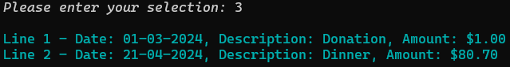  
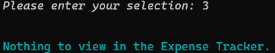  

- CSV file is opened in ```reader``` mode and displays all existing expenses using ```f-string```

<details>
<summary>Click to expand code</summary>

```
def view_expense(file_name):
    try:
        with open(file_name, "r") as f:
            reader = csv.reader(f)
            reader.__next__()
            row_count = 0
            for index, row in enumerate(reader):
                print(
                    colored.stylize(
                        f"Line {index+1} - Date: {row[0]}, Description: {row[1]}, Amount: ${row[2]}",
                        styling.output
                    )
                )
                row_count =+ 1
        if not row_count:
            add_line_break()
            print(colored.stylize(
                    "Nothing to view in the Expense Tracker.", styling.output
            ))

    except FileNotFoundError:
        print(colored.stylize(
            "Expense Tracker file does not exist.", styling.error
        ))
    
    finally:
        add_line_break()
```
</details>

### Feature 4: Search Expense In $ Range 
- User inputs min and max range of dollar amount
- If user input is valid, it displays all expenses within the range. Data is valid when min and max amount is a positive float and max amount is greater than min amount
- Displays a message if no expenses are within range
- If user input is invalid, it prompts for a retry and error message appears 
- Prompts if user would like to search another range
- If user input is invalid for search another expense, it returns to the main menu

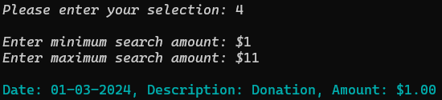  
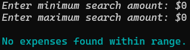  
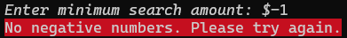  
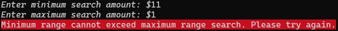  
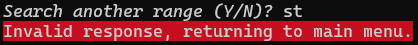  

- ```search_expense``` and ```search_another_expense``` are separate functions to keep the them small (following Google Python style guide)
- CSV file is opened in ```reader``` mode and displays all expenses within range using ```f-string```

<details>
<summary>Click to expand code</summary>

```
def search_expense(file_name):
    try:
        min_input = float(input(
        colored.stylize("Enter minimum search amount: $", styling.input)
        ))

        if min_input < 0:
            raise NegativeError
        
        max_input = float(input(
            colored.stylize("Enter maximum search amount: $", styling.input)
        ))

        if max_input < 0:
            raise NegativeError
        
        if min_input > max_input:
            raise RangeError
        
        add_line_break()
        
        with open(file_name,"r") as f:
            reader = csv.reader(f)
            reader.__next__()
            row_count = 0
            for row in reader:
                if (min_input <= float(row[2]) <= max_input):
                    print(colored.stylize(
                            f"Date: {row[0]}, Description: {row[1]}, Amount: ${row[2]}", styling.output
                    ))
                    row_count =+ 1
            if not row_count:
                print(colored.stylize(
                    "No expenses found within range.", styling.output
                ))
        
        add_line_break()

        search_another_expense(file_name)

    except ValueError:
        print(colored.stylize(
            "Invalid data entered, use numbers only. Please try again.", styling.error
        ))
        search_expense(file_name)
    except NegativeError:
        print(colored.stylize(
            "No negative numbers. Please try again.", styling.error
        ))
        search_expense(file_name)
    except RangeError:
        print(colored.stylize(
            "Minimum range cannot exceed maximum range search. Please try again.",
            styling.error
        ))
        search_expense(file_name) 
    except FileNotFoundError:
        print(colored.stylize(
            "Expense Tracker file does not exist.", styling.error
        ))

def search_another_expense(file_name):
    search_another_input = input(
        colored.stylize("Search another range (Y/N)? ", styling.input)
    )
    if search_another_input.lower() == "y":
        add_line_break()
        search_expense(file_name)
    elif search_another_input.lower() == "n":
        add_line_break()
    else:
        print(colored.stylize(
            "Invalid response, returning to main menu.", styling.error
        ))
        add_line_break()
```
</details>

### Feature 5: Exit 
- Displays farewell message
- Exits application


## Implementation Plan

## Help Documentation

### Code Style Guide
My application adheres to the [Google Python Style Guide](https://google.github.io/styleguide/pyguide.html).

Some of the styling guides that I have implemented in my code includes:
- Use import statements for packages and modules only, not for individual types, classes, or functions
- Import each module using the full pathname location of the module
- Imports should be on separate lines 
- Exceptions - Never use catch-all except: statements, or catch Exception or StandardError
- True/False Evaluations - Use the “implicit” false if at all possible
- Lexical scoping
- Maximum line length is 80 characters
- Use parentheses sparingly
- Whitespace standard rules
- Use a f-string when appropriate

### Referenced Sources
- Google Python Style Guide: https://google.github.io/styleguide/pyguide.html
- datetime: https://docs.python.org/3/library/datetime.html
- Colored: https://dslackw.gitlab.io/colored/user_guide/user_guide/#user-guide


